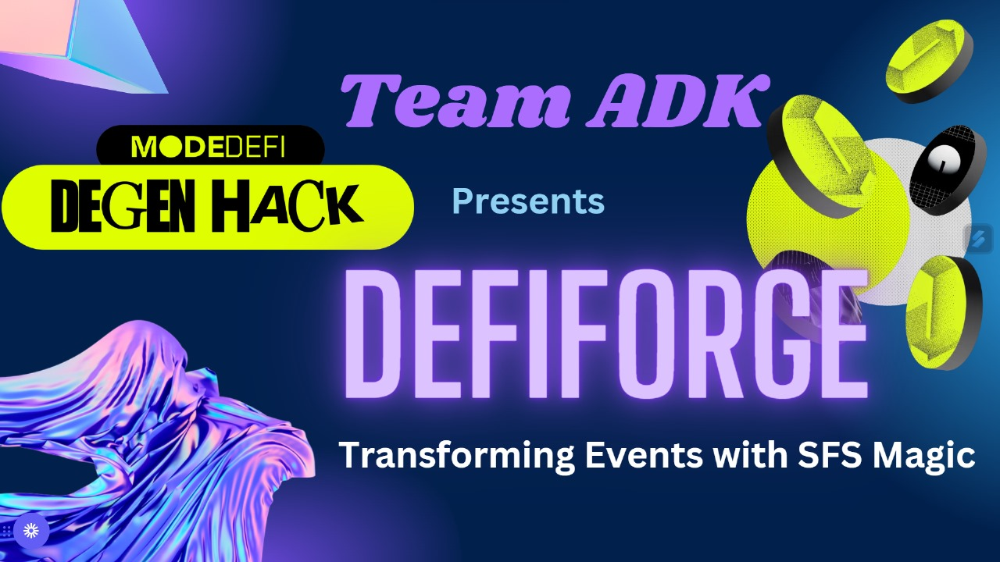
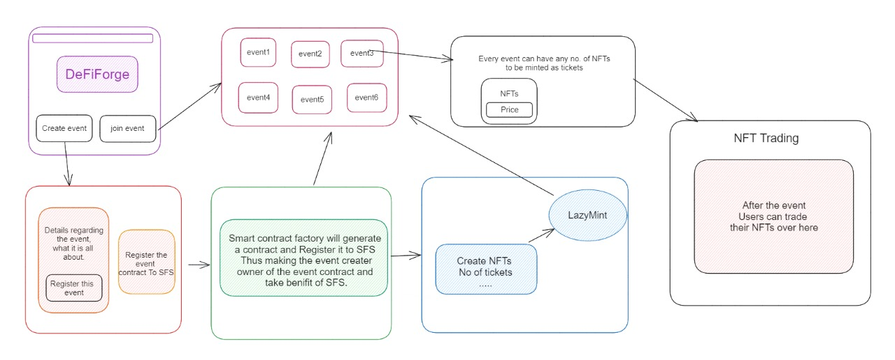
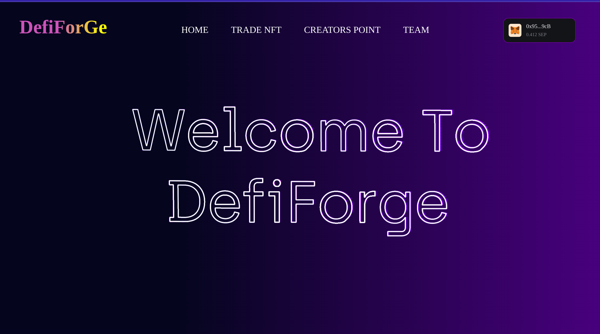
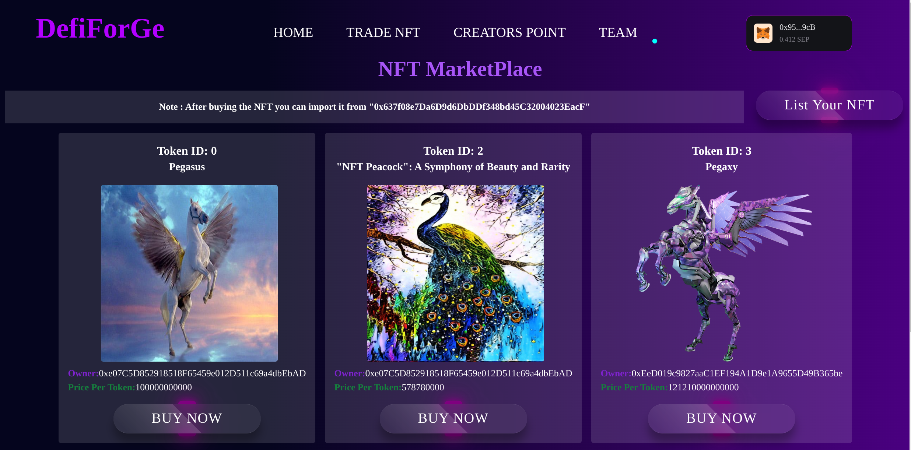
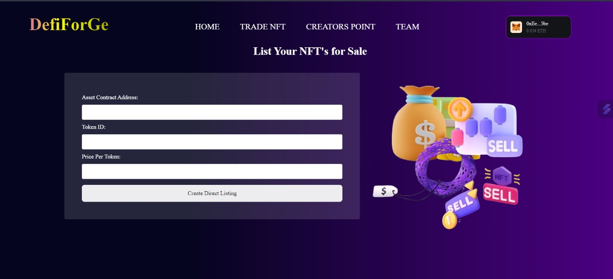
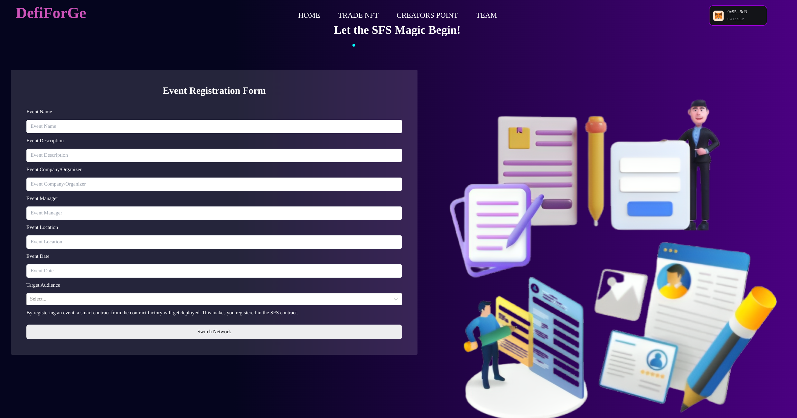

# DefiForge: Transforming Events with SFS Magic

Step into the future of event management with DeFi apps and Non-Fungible Tokens (NFTs). Imagine your ticket as a unique, blockchain-verified digital asset, revolutionizing event access. These NFT tickets bring exclusivity, immutability, and a new level of authenticity, waving goodbye to traditional passes.

Welcome to a dynamic era where each NFT ticket is a digital masterpiece, unlocking a world where technology and entertainment converge in unprecedented ways. Experience the NFT-powered future of events!

# What is DefiForge?

DefiForge is not your typical event platform; it's reshaping the game. Picture a world where events aren't just organized but celebrated uniquely. How? Smart contracts, fueled by MODE's Sequencer Fee Sharing (SFS), make events dynamic and financially rewarding for all. Forget jargon; it's about excitement for everyone—organizers, developers, and party people. With cool NFTs offering VIP access and unique ownership, DefiForge pioneers an NFT marketplace. Join us, where events aren't just moments; they're unforgettable experiences with opportunities that linger long after the party ends!🚀🎉


## Key Features:

1. **Dynamic Event Creation with Smart Contracts:** Elevate events with the `Event_Registration_Factory` smart contract, offering dynamic and customizable event generation through dedicated `Event_contract` instances.

2. **Seamless Revenue Sharing with SFS:**  Leverage the power of the SFS (Sequencer Fee Sharing) contract to ensure transparent and fair revenue distribution to Event Managers and Developers.

   - **For Developers:** As the owner of the `Event_Registration_Factory` contract, receive revenue shares from the SFS contract whenever an event is registered.

   - **For Event Creators:** As the owner of the `Event_contract` contract, receive revenue shares from the SFS contract whenever NFT tickets are sold.
  
3. **NFT-Based Event Access:** Engage users through NFTs, providing exclusive event access and ownership of unique tokens, enhancing the overall event experience.

4. **NFT Marketplace for Post-Event Trading:** Pioneering an NFT marketplace, DefiForge allows buyers of NFT event tickets to trade post-event, unlocking additional benefits and potentially increasing market value.

5. **Fostering Exclusive Experiences:** DefiForge intertwines dynamic event creation, transparent revenue sharing, and an NFT marketplace to craft unforgettable, exclusive moments for participants.




# Visit to our Website:
- ## Home Page:
 

 - ## NFT MarketPlace:

- ## NFT Listing Page:

- ## Event Registration Form:
  


# Alternate_Implementation of SFS->
 ## Centralisation Problem in SFS->
  - In the realm of blockchain collaboration, the Sequencer Fee Sharing (SFS) contract holds the promise of equitable revenue distribution. However, a critical drawback surfaces—a one-person rule. Currently, only a single developer can seize the opportunity to register their project, consolidating exclusive control over the entire earnings pool. It's akin to attending a concert where only one artist graces the stage, monopolizing the spotlight.

  - This limitation hinders the collaborative spirit and inclusive ethos essential for shared ownership and mutual success. The SFS is inadvertently staging a solo performance, excluding valuable contributors from the revenue-sharing spotlight.

## Decentralised Solution: Transforming SFS Contracts for Collaborative Success->
In the updated Sequencer Fee Sharing (SFS) contract, We've tackled the centralization issue with a more collaborative and inclusive approach:

- **Multiple Developers Registration**: Now, multiple developers can register their smart contracts simultaneously, fostering a shared ownership structure.

- **Individual Revenue Shares**: Developers can specify their unique share in revenue fees during registration, ensuring fairness and acknowledging diverse contributions.
- **Flexible Assignment and Withdrawal**: Many Developers can dynamically register their contracts using pre-assigned NFT and withdraw earned fees, enhancing flexibility.
- **Proportional Fee Distribution**: The distributeFees function proportionally distributes fees based on specified shares, promoting fair revenue allocation.

This evolution empowers developers to actively contribute, share ownership, and enjoy fair revenue distribution in collaborative blockchain projects.

**For demonstration purpose please visit [Demonstration](./Alternate_Implementation_SFS/Demonstration.md) page**


# Tech-Stack:
| Technology              | Documentation Link                  |
| :----------------------:| :---------------------------------:|
| NextJS          | [NextJS Documentation](https://nextjs.org/)|
| Tailwind CSS            | [Tailwind CSS Documentation](https://tailwindcss.com/docs) |
| ThreeJS               | [ThreeJS](https://threejs.org/) |
| Canva                   | [Canva](https://www.canva.com/)     |
| Solidity                | [Solidity Documentation](https://docs.soliditylang.org/) |
| Hardhat                 | [Hardhat Documentation](https://hardhat.org/getting-started/) |
| Mode Testnet        | [Mode Testnet](https://docs.mode.network/mode-testnet/mode-testnet-information) |
| Ethers.js Library       | [Ethers.js Documentation](https://docs.ethers.io/v5/) |
| ThirdWeb                   | [ThirdWeb Documentation](https://thirdweb.com/) |
| Mode SFS                 | [MODE SFS](https://docs.mode.network/build-on-mode/sfs-sequencer-fee-sharing)    |


# Technologies:
- **NextJS**: We've chosen Next.js for our frontend development. This powerful framework, built on React, enables fast and dynamic user experiences. With features like server-side rendering and automatic code splitting, Next.js streamlines development, ensuring an engaging and visually appealing interface for users navigating the decentralized event management world in DefiForge.      


- **ThreeJS**: It takes center stage, enhancing visual aesthetics with captivating particle effects. Utilized prominently in the `Welcome to DefiForge` headline on our homepage, three.js brings dynamic 3D scenes to life, elevating user engagement and creating a visually stunning experience throughout our decentralized event management platform


- **Tailwind CSS**: We've harnessed the remarkable capabilities of Tailwind CSS to craft an interface that is not only visually captivating but also incredibly user-friendly. Say farewell to the era of hefty and convoluted stylesheets, as Tailwind CSS ushers in a new paradigm of streamlined and efficient styling.


- **Canva**: Infusing our design aesthetics with the creative prowess of Canva, we ensure a user-centric experience defined by visually captivating interfaces. By harnessing Canva's tools, we craft an environment that resonates with users, elevating engagement and fostering an intuitive journey through our decentralized video sharing and chatting application.

- **Solidity**: Solidity, our project's backbone, orchestrates smart contracts dictating event dynamics, revenue sharing, and NFT-related transactions. This blockchain technology guarantees trustless, secure, and customizable event experiences, transforming event management for creators and developers. Solidity's prowess extends to NFT interactions, ensuring a comprehensive and seamless integration of blockchain capabilities into our platform.
  
- **Hardhat**:Streamlining our smart contract development, we lean on Hardhat—a dynamic development environment and testing network for Ethereum smart contracts. With Hardhat's agile toolkit, we expedite the creation, debugging, and testing of our blockchain components, ensuring a seamless and efficient journey in bringing our decentralized video sharing and chatting application to life on the Ethereum platform.
- **Mode Testnet**: we utilize the Mode testnet for deploying smart contracts and testing interactions with the Sequencer Fee Sharing (SFS) contract. This testnet provides a secure and controlled environment for thorough validation, ensuring the reliability and functionality of our blockchain components before transitioning to the mainnet. Mode testnet is instrumental in refining and optimizing our smart contracts, contributing to the robustness of DefiForge's decentralized event management system.
- **ThirdWeb**:Thirdweb, an integral part of our project, drives our NFT-related initiatives. This innovative platform plays a key role in the creation, management, and seamless interaction with NFTs. By harnessing Thirdweb's capabilities, our project ensures efficiency, security, and a user-friendly experience for participants engaged in the dynamic world of digital assets.
- **Mode SFS**: Mode Sequencer Fee Sharing (SFS) sparks a revolution in event management, disrupting traditional norms. This game-changing mechanism ensures fair rewards for developers and creators alike. With SFS, registering smart contracts and selling NFT tickets bring instant and transparent revenue shares, fostering collaboration and reshaping the event landscape, thus ewriting the rules for event coordination in a decentralized era.
  
# Detailed Docs
Our project is meticulously documented, showcasing a wealth of information presented with captivating visual enhancements on Canva. Explore the intricacies of our work through this meticulously crafted documentation, where clarity meets creativity, offering an immersive experience that goes beyond the conventional.

https://www.canva.com/design/DAF28gEUJBE/ndDhaD5bySiUbDQLZSbTOw/view?utm_content=DAF28gEUJBE&utm_campaign=designshare&utm_medium=link&utm_source=editor

# Getting Involved:
 Are you thrilled about the revolution in event management with DefiForge? Join our community:

  * **Developers**: Become a part of our innovation journey. Contribute to enhancing our platform—fork our repository and submit pull requests.
  * **Feedback**: Your insights matter! Share your ideas and suggestions to shape the future of DefiForge by opening an issue on our GitHub repository.

**Let's build the future of events together!** 🚀🌟

# Stay Connected:
- Stay updated with the latest news, features, Events & NFT_tickets trends:

- Download the DefiForge DApp today and immerse yourself in the future of events, where every moment is a celebration powered by blockchain innovation.

 🚀 **Unleash the extraordinary—because every event deserves to be legendary!** 🎉 

 

## Getting Started

To embark on your journey with DefiForge, follow these straightforward steps:

1. **Clone the Repository:**
  ```bash
    $ git clone https://github.com/your-username/DefiForge.git
  ```
2. **Install Dependencies:**
 ``` bash
      $ npm install
  ```    
3. **Smart Contract Deployment:**
  Set up and deploy the required smart contracts.

4. **Configuration Customization:**
Tailor configurations as needed for your specific use case.

5. **Run the Application:**

   Run the following command->
``` bash
    $ npm run dev
```
